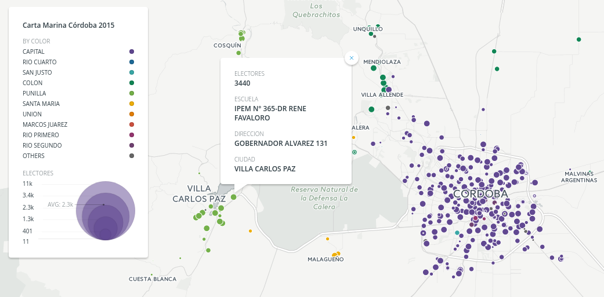

# Curso práctico de periodismo de datos en elecciones legislativas
 
## Objetivo
Identificar, buscar, analizar y visualizar datos de elecciones legislativas.  
Analizar casos pre y post elección

## Resultados esperados

Un mapa de escuelas y electores en cada una

## Requisitos y recomendaciones
Es necesario o recomendable tener: 
 - una conexión a internet decente ya que habrá muchas tareas online.
 - una cuenta de Gmail o compatible para usar Google Drive, MyMaps y Fusion Tables.
 - una cuenta en [Carto](https://carto.com/) (es gratuita)
 - es útil traer descargado e instalado [Tabula PDF](http://tabula.technology/)
 
### Datos a conocer y usar
 - Carta marina
 - Polígonos de circuitos electorales
 - Lista de legisladores vigentes y nuevos candidatos
 - Resultados electorales

### Trabajos prácticos

#### Carta Marina
Pasar la Carta Marina de PDF a Excel o CSV con Tabula PDF. [IR](curso/carta-marina-Cordoba.md).   
Geolocalizar escuelas sin coordenadas. Fusion Tables, MyMaps Carto. [IR](curso/geolocalizar-csv.md)  
Analisis de las escuelas con mayor y menor cantidad de electores. Sugerencia: Buscar el porque.  
 
#### Polígonos de circuitos electorales
Buscar y visualizar.  
Entender el formato KML y GeoJSON. Google MyMaps. QGis.  
Cruzar con resultados.  
Lista de legisladores vigentes y nuevos candidatos.  
Cantidad de disputados en Córdoba. Que se elige y que bancas se renuevan.  
Sistema Dhont y probabilidades según encuestas de bancas a ocupar.  
Resultados de las elecciones.  
Visualizar teniendo en cuenta las escuelas y los polígonos usados anteriormente.  
Que es un Fraudómetro?  
Graficar un hemiciclo con la representación legislativa.  

 
PDF, pasar vía tabula a CSV (Que es un CSV y como se distingue de Excel).  
Geolocalizar en mapa. Agregar tamaño de puntos según cantidad de electores o mesas.  
Mapa colaborativo para validar puntos.  
 
### Polígonos de circuitos electorales
Donde se consiguen. Para que sirven  
Descargar y pintar polígonos según resultados de elecciones anteriores.  
 
### Resultados electorales
Como se publican?  
 - Hemiciclos y visualizaciones de cuerpos representativos.
 
 
