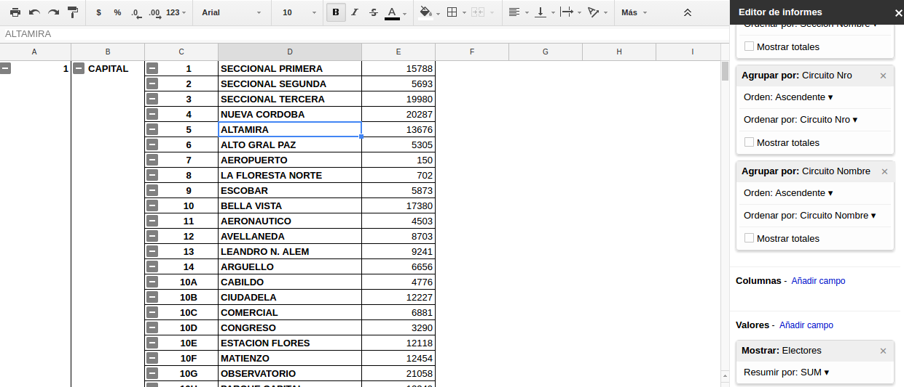

## Agrupar datos

Las [_tablas dinmámicas_ (o _pivot tables_)](https://es.wikipedia.org/wiki/Tablas_din%C3%A1micas) son una herramienta para análisis de bases de datos (BD). Se encargan de resumir y ordenar la información contenida en la BD.  

En nuestro caso disponemos de las escuelas de todos los circuitos electorales y necesitamos agrupar la cantidad de electores por estos circuitos.  

Para esto desde la planilla de escuelas vamos al menú _Datos_ y elegimos la opción tabla dinámica.  

Esta nos permitira agrupar por Circuitos y Secciones sumarizando sus electores.
Los campos a listar se eligen a la derecha en _filas_. Los valores se definen a la derecha eligiendo algun campo numéricos de la sección _valores_.  

Estos datos pueden copiarse y pegarse _solo como valores_ en otra planilla para continuar el trabajo sobre estos datos.  
