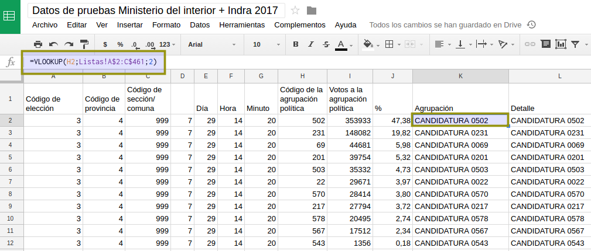

## Analizando los resultados de la elección

Luego de [procesar los datos de la elección](analizar-datos-ministerio-interior-e-Indra.md) es el momento de ordenar estos datos y visualizarlos.  

### Resultados totales provincia por lista

Como primer análisis vamos a ver y ordenar los datos totales por provincia.  
Para eso en una hoja nueva replicamos (usamos el signo igual y clickeamos en la 
celda que deseamos replicar aunque esté en otra hoja) la parte de los datos que 
nos interesan. Los datos de interés son los que tienen el código _999_ en la hoja 
de _totales listas 04_.  

```
Es importante replicar las celdas y no _copiar y pegar_ para que cuando actualicemos 
los datos en la hoja de origen todo lo que hagamos quede actualziado automáticamente.  
```

En un primer paso los datos deben verse así


Una de las columnas incluye el porcentaje de la agrupación, este número viene sin 
decimales. Necesitamos hacer una nuestra con la formula que corresponde.

La función es:

```
=I2/sum(I$2:I$12) * 100
```
Esa formula puede estirarse para completar hasta el final. Analizar la necesidad de los 
signos _$_.  


Lo que necesitamos a continuación son los nombres de las agrupaciones. Si bien podemos hacerlo 
a mano es bueno conectarlo a la lista accesoria con los nombres de las agrupaciones incluidas.  

La función _VLOOKUP_ (Vertical Lookup) permite dado un código devolver datos relacionados a 
ese mismo código en otra tabla. En este caso tenemos el código de la agrupación y en una tabla 
accesoria dos datos (nombre y descripción) de la agrupación.  

La formula para la primera fila.
```
=VLOOKUP(H2;Listas!A$2:C$461;2)
```

**Nótese** nuevamente la necesidad del signo _$_.  

Debe quedar así:




