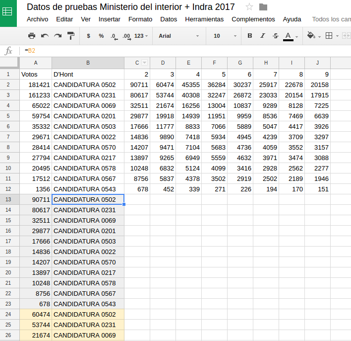
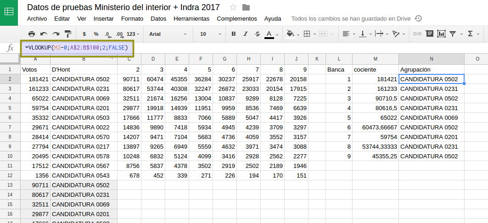

## Analizando los resultados de la elección

Luego de [procesar los datos de la elección](datos-ministerio-interior-e-Indra.md) es el momento de ordenar estos datos y visualizarlos.  

### Resultados totales provincia por lista

Como primer análisis vamos a ver y ordenar los datos totales por provincia.  
Para eso en una hoja nueva replicamos (usamos el signo igual y clickeamos en la 
celda que deseamos replicar aunque esté en otra hoja) la parte de los datos que 
nos interesan. Los datos de interés son los que tienen el código _999_ en la hoja 
de _totales listas 04_.  

```
Es importante replicar las celdas y no _copiar y pegar_ para que cuando actualicemos 
los datos en la hoja de origen todo lo que hagamos quede actualziado automáticamente.  
```

En un primer paso los datos deben verse así


Una de las columnas incluye el porcentaje de la agrupación, este número viene sin 
decimales. Necesitamos hacer una nuestra con la formula que corresponde.

La función es:

```
=I2/sum(I$2:I$12) * 100
```
Esa formula puede estirarse para completar hasta el final. Analizar la necesidad de los 
signos _$_.  


Lo que necesitamos a continuación son los nombres de las agrupaciones. Si bien podemos hacerlo 
a mano es bueno conectarlo a la lista accesoria con los nombres de las agrupaciones incluidas.  

La función _VLOOKUP_ (Vertical Lookup) permite dado un código devolver datos relacionados a 
ese mismo código en otra tabla. En este caso tenemos el código de la agrupación y en una tabla 
accesoria dos datos (nombre y descripción) de la agrupación.  

La formula para la primera fila.
```
=VLOOKUP(H2;Listas!A$2:C$461;2)
```

**Nótese** nuevamente la necesidad del signo _$_.  

Debe quedar así:


Es necesario ordenar estos datos según la cantidad de votos que irá cambiando durante el día 
de la elección. Para es útil la función _sort_.   

Debajo de la lista anterior podemos poner la fórmula: 

```
=sort(A2:E12;2;FALSE)
```

Se generará automáticamente una nueva lista con los datos ordenados. Estos se actualizarán 
automáticamente cuando los datos cambien.  

Con las herramientas [usadas para publicar y visualizar planillas](https://avdata99.github.io/Curso-practico-de-periodismo-de-datos-en-elecciones-legislativas/curso/publicar-tablas-y-graficos.html) es posible publicar en tiempo real esta tabla y un gráfico.  

```
Probar en la lista original de resultados y ver como se reordena la lista y se actualizan los gráficos. 
```

#### D'Hont

Podemos tener los resultados en D'Hont en tiempo real calculados solo convinando fórmulas de Google Drive.  
El primer paso es replicar (igualar) en una nueva hoja de nuestro documento los votos 
finales y el nombre de cada agrupación:  


En segunda instancia, aplicando la metodología del sistema _D'Hont_ obtenemos los cocientes.  
Nótese nuevamente el signo _$_ para extender la fórmula horizontal (hasta la cantidad 
de bancas a cubrir) y verticalmente.  

```
=$A2/C$1
```


A continuación vamos a hacer algo extraño pero que:
 - evitar necesitar un programador para el cálculo
 - se va a entener mejor en los próximos pasos

Replicaremos (igualando) las celdas con los nombres de las agrupaciones 9 veces hacia abajo.  
Tambien replicaremos (igualndo) los valores de cada una de las nueve columnas.  

Se verá así (los colores no son necesarios, solo explicativos).  



Ahora agregamos nuestra tabla de resumen a la derecha donde quedarán listadas las 
agrupaciones en posición de obtener la banca.  

La función _LARGE_ nos da los valores máximos o mínimos en el orden que 
necesitamos

```
=large(A$2:A$100;L2)
```
Note los signos _$_ y luego estire la funcion hasta la novena banca.  


A continuación, usando la función _LOOKUP_ 
**que sólo busca en la primera columna de un rango dado** es posible saber a que partido le 
corresponde un coeficiente.

```
=VLOOKUP(M2-0;A$2:B$100;2;FALSE)
```
Note los signos _$_ y luego estire la funcion hasta la novena banca.  



