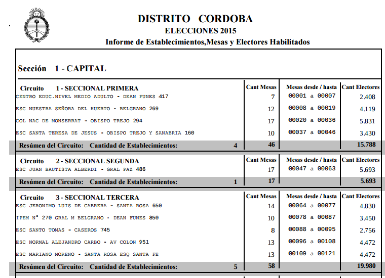
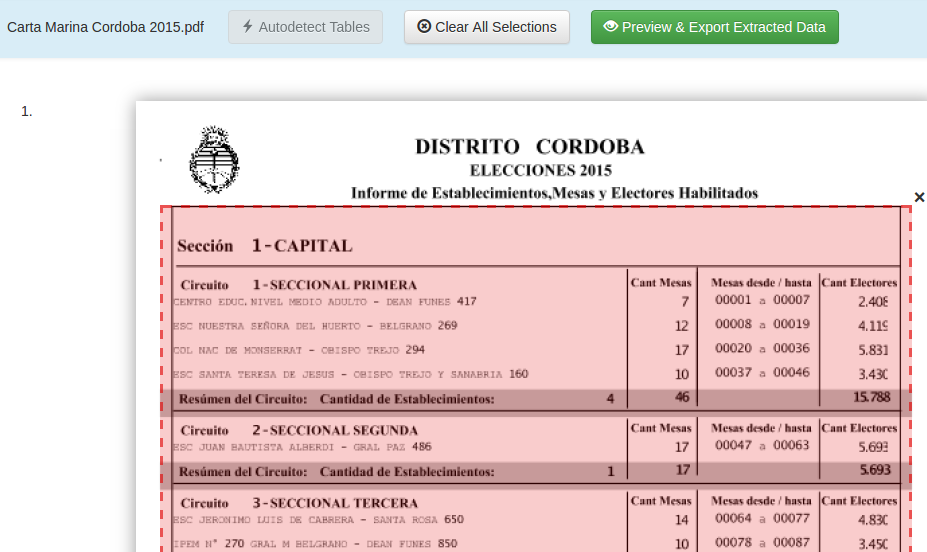
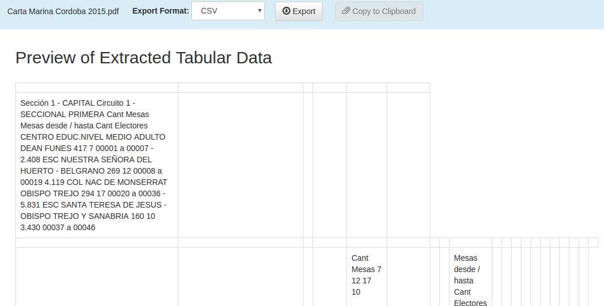

# Procesar la carta marina Córdoba 2015

Una búsqueda en Google dará con una lista de [recursos en el poder judicial de Nación sobre CORDOBA](https://www.pjn.gov.ar/cne/secelec/secciones/otros/otros_view.php?oID=674&dID=4). Hay de todas las provincias. Lamentablemente son PDF difíciles de procesar en general.  

Allí se encuentra la [Carta Marina Córdoba 2015 en PDF](https://www.pjn.gov.ar/cne/secelec/document/otros/4-Carta%20Marina%202015.pdf).  

Una vez descargado se debe abrir con [Tabula PDF](http://tabula.technology/). Este producto libre y gratuito permite pasar tablas a formatos reutilizables de datos.  

Como primera prueba se puede seleccionar directamente una parte de la tabla para analizar si el resultado es útil.  

Luego del proceso se ven los resultados pasados a una tabla de datos reutilizable.  

Se ve que no tomo correctamente las celdas como uno podría imaginar. Se requiere que cada dato esté en una celda individual. El que construyo el PDF no lo hizo construyendo una tabla ordenadamente sino que dejo varias líneas de texto en cada _celda_.  

Como prueba adicional se puede usar el detector automático de tablas en Tabula y ver los resultados. 

[GitHub CSV](https://github.com/OpenDataCordoba/elecciones2015/blob/master/resources/carta-marina/escuelas-elecciones-2015-cordoba.csv) - ([RAW CSV](https://github.com/OpenDataCordoba/elecciones2015/blob/master/resources/carta-marina/escuelas-elecciones-2015-cordoba.csv?raw=true) procesado [con python](https://github.com/OpenDataCordoba/elecciones2015/tree/master/resources/carta-marina) ya 
 que no contiene tablas extraibles)