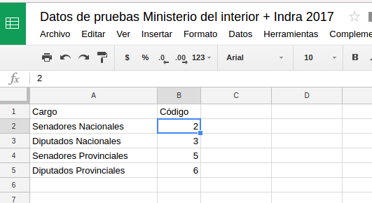

## Análisis de datos de Indra

Para 2017 (al igual que 2015) los interesados pueden recibir datos de la elección durante el día de la misma y posteriormente. Estos datos se entregan en formatos reutilizables.  

Si desean formar parte del grupo que recibe esta información técnica es necesario manifestarlo por email a Yanina Sandra Martinez <ymartinez@mininterior.gob.ar>. Esta es la forma que el Ministerio del Interior provee esta información.  

Para las elecciones 2017 todos estos datos se compartieron [aquí](https://github.com/avdata99/datos-indra-dia-eleccion-paso-2017-AR/blob/master/info-previa-DINE.md).  

El documento indica cuales y en que formatos están los documentos. El proceso a 
continuación es el uso de estos datos para construir resumenes y visualizaciones útiles.  

Para procecar estos daton abrimos una planilla de cálculo nueva de Google Drive.  

### Archivos incluidos

#### Tipos de elección

El primer dato es la lista de códigos para los cargos electivos. No esta en un CSV, es un texto suelto.  
Copiamos el texto y lo pegamos en la planilla. 

Luego seleccionamos las celdas con texto y usamos la funcionalidad de _Dividir texto en columnas_ (en el menú _datos_) con el separador " = " (espacio, signo igual, espacio). Además le agregamos encabezado a las columnas. 

#### Ámbitos electorales

El alcance máximo de estos datos son las secciones electorales (en Córdoba, Departamentos). La lista de estos departamentos esta en el archivo [_ambitos_00.csv_](https://github.com/avdata99/datos-indra-dia-eleccion-paso-2017-AR/blob/master/recursos/DATOS-MUESTRA-2017-08-01/generales_00/ambitos_00.csv).  

Tip: Este archivo en este caso está en la plataforma _GitHub_ (la más usadas por los programadores para compartir código y datos). Para poder ver esto en su formato real y descargarlo o copiarlo le agregamos _?raw=true_ al final de link en el navegador.  

