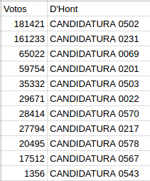
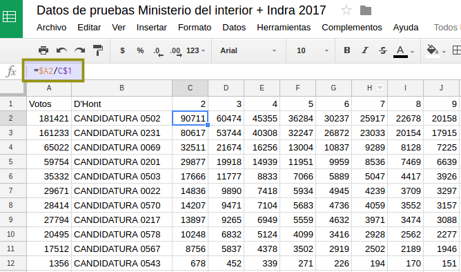
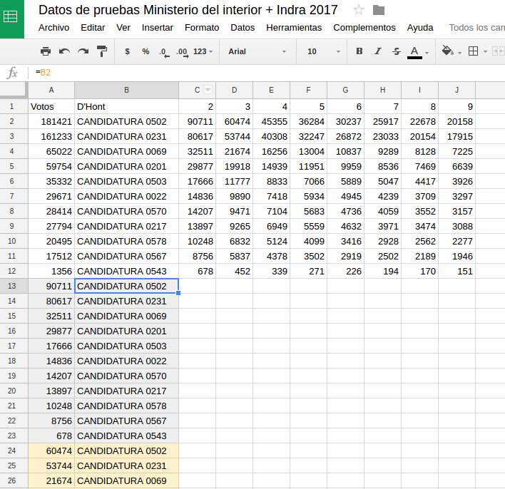
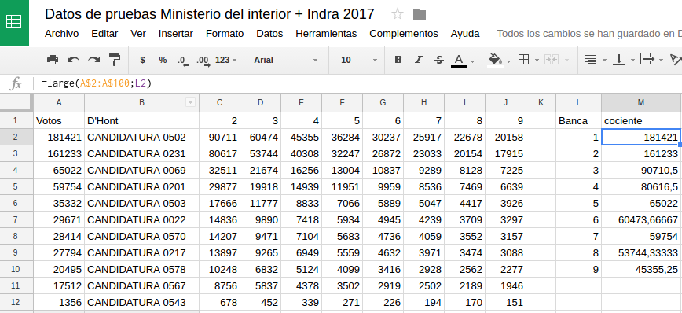
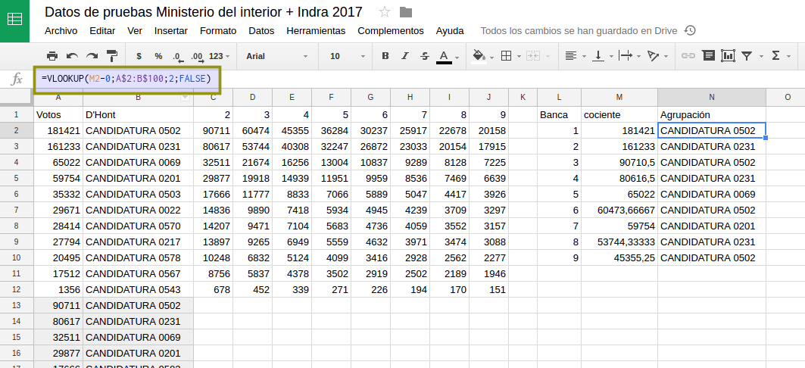
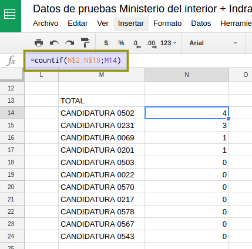

## D'Hont

Luego de [ordenar los datos de la elección](analizar-datos-ministerio-interior-e-Indra.md) es el momento de ordenar estos datos y visualizarlos. 

Podemos tener los resultados en D'Hont en tiempo real calculados solo convinando fórmulas de Google Drive.  
El primer paso es replicar (igualar) en una nueva hoja de nuestro documento los votos 
finales y el nombre de cada agrupación:  



En segunda instancia, aplicando la metodología del sistema _D'Hont_ obtenemos los cocientes.  
Nótese nuevamente el signo _$_ para extender la fórmula horizontal (hasta la cantidad 
de bancas a cubrir) y verticalmente.  

```
=$A2/C$1
```




A continuación vamos a hacer algo extraño pero que:
 - evitar necesitar un programador para el cálculo
 - se va a entener mejor en los próximos pasos

Replicaremos (igualando) las celdas con los nombres de las agrupaciones 9 veces hacia abajo.  
Tambien replicaremos (igualndo) los valores de cada una de las nueve columnas.  

Se verá así (los colores no son necesarios, solo explicativos).  



Ahora agregamos nuestra tabla de resumen a la derecha donde quedarán listadas las 
agrupaciones en posición de obtener la banca.  

La función _LARGE_ nos da los valores máximos o mínimos en el orden que 
necesitamos

```
=large(A$2:A$100;L2)
```
Note los signos _$_ y luego estire la funcion hasta la novena banca.  



A continuación, usando la función _LOOKUP_ 
**que sólo busca en la primera columna de un rango dado** es posible saber a que partido le 
corresponde un coeficiente.

```
=VLOOKUP(M2-0;A$2:B$100;2;FALSE)
```
Note los signos _$_ y luego estire la funcion hasta la novena banca.  



#### Totales de bancas por agrupación

Finalmente podemos saber el total de bancas por agrupación podemos en una hoja 
nueva. Para esto replicamos (siempre igualando) la lista de agrupaciones en una columna.  

En una columna lateral _total de bancas_ usamos la función _COUNTIF_ que permite **contar** 
elementos que se repiten en una lista. El primer parámetro es el rango, el segundo el valor buscado.  

Note y comprenda la necesidad del signo _$_.  

```
=countif(N$2:N$10;M14)
```

