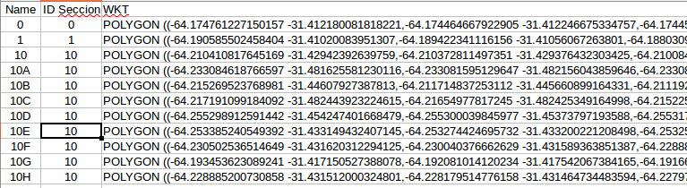

## Formatos de datos espaciales

Llamamos datos _espaciales_ a aquellos que refieren a la ubicación en un espacio de referencia.  
Decimos que son datos _georreferenciados_ cuando esa referencia se establece sobre la superficie terrestre. [Ver más en Wikipedia](https://es.wikipedia.org/wiki/Base_de_datos_espacial).  

Para representar datos georeferrenciados (en un plano de dos dimensiones) usamos tres tipos de objetos:
 - **Puntos**: Incluye dos valores que representan la latitud y la longitud. No existe una forma única de representar estos valores. Hay cientos de formas de representar estos valores, estos se llaman _Sistemas de proyección cartográfica_. Tengamos en cuenta que nuestro planeta es una espera y para representar una ubicación solo con dos puntos (dimensiones) necesitamos _proyectar_ esa esfera en un plano de dos dimensiones.
 - **Lineas**: Un conjunto de _puntos_ conectados, por ejemplo el recorrido de una linea de transporte público.
 - **Polígonos**: Igual que una línea pero se entiende que el último se conecta al primero formando un figura cerrada. Ejemplo: poligono de los límites de una ciudad o estado.

Con estos tres alcanza para la gran mayoría de los casos aunque hay casos complejos y especiales que no exceden el alcance de este apunte.  

[Ver más sobre proyección cartográfica](https://es.wikipedia.org/wiki/Proyecci%C3%B3n_cartogr%C3%A1fica).  

Los formatos de interés para un periodista de datos o usuario de datos espaciales son (no en orden de importancia):  

### KML

Es un archivo de texto que usa el marcado XML. Incluye la descripcion de objetos espaciales con coordendas. Puede enriquecese incluyendo estilos gráficos (ancho y color de bordes, rellenos, íconos, etc). Es usado por Google MyMaps y muchos otros para exportar.  
[Ver más en Wikipedia](https://es.wikipedia.org/wiki/KML).  

### WKT (para CSV)

Es una forma de texto muy simple para describir objetos espaciales. Es útil para combinar como columna extra en CSV. Es compatible con muchas herramientas de mapeo.  
[Ver más en Wikipedia](https://es.wikipedia.org/wiki/Well_Known_Text)

### SHP
Es un formato de archivo propietario de datos espaciales desarrollado por la compañía ESRI. En realidad son múltiples archivos (uno para las corrdenadas, otros para los datos y otro para los índices) que suelen incluirse en uno final comprimido. Es usado en los entornos más técnicos de cartógrafos y afines. hay mucho material interesante en este formato. Se puede pasar a formatos más _amigables_ con productos como QGis u Ogr2ogr.  

[Ver más en Wikipedia](https://es.wikipedia.org/wiki/Shapefile)

### GeoJSON
Es un archivo de texto que cumple con las normas JSON pero que incluye datos espaciales.  
[Ver más sobre GeoJSON](http://geojson.org/).  

