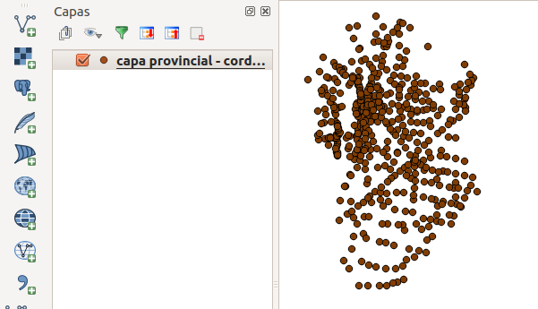

### Geolocalizar Circuitos fuera de la capital.

Fuera de la capital la realidad de Córdoba es compleja en cuanto a polígonos de límites de ciudades. Más del 80% del territorio provincia no pertenece a ningún municipio y los territorios que si pertenecen se encuentran en disputas actualmente.

[Ver más info](https://andresvazquez.com.ar/blog/los-municipios-de-cordoba-no-existen/)

La forma posibles es el uso de _localidades censales_ descriptos en [el capítulo de recursos greográficos](poligonos.md).  

Antes de eso tomamos nuesra lista de Circuitos trabajados en base a la carta marina 2015.  
[Circuitos y electores 2007 - 2017](../recursos/circuitos-y-electores-2007-2017.csv).  
Este recurso incluye a todos los circuitos vía carta marina a excepción de la Capital que fue unificada como una única ciudad.

[Localidades censales en SHP](../recursos/Capa-provincial-Cordoba-Localidades-Censales-2010-SHP.zip).  

Añadir como capa vectorial con QGis.  

Probar si la proyección esta bien poniendo un mapa real de fondo.  

Exportar a CSV con datos espaciales.  

Proyección _Posgar 94 EPSG:22184_ se usa muchas veces en datos producidos en Argentina. En este caso es la del SHP de origen.  
Proyección _Pseido Mercator EPSG:4326_, recomendada para exportar siempre, es la que usamos para exportar.  

[Localidades censales en CSV desde el SHP](../recursos/localidades-censales-2010.csv).  

Ahora tenemos un CSV con campos espaciales junto a los datos de cada localidad censal usada en 2010 con motivo del censo. Son 522 registros (mas que las localidades reales de la Provincia de Córdoba).  

Es necesario conectarlas de modo de contar con una lista unificada de datos útiles (electores o diferencias entre ellos) y la geolocalización de cada uno. Esto es posible con un proceso complejo que sería mucho más simples **si fuera norma usar identificadores únicos para todos los datos liberados por los gobiernos**. Esto no sucede y tenemos que conectar datos por textos escritos de diferentes formas.  

Una forma de hacerlo sin desarrollar software o usar algoritmos para esto es tomar ambas listas y ordenar cada una por _departamento/sección_ y en segundo lugar por nombre de la _ciudad/circuito_. Esto es mejor que hacerlo simplemente por circuito ya que hay nombres similares que se repiten.  

Una vez ordenadas ambas listas se pegan ambas en una nueva planilla en columnas consecutivas.  

A continuación deberán acomodarse las filas (el proceso tiene su complejidad pero no debería llevar mucho tiempo).  

[CSV terminado](../recursos/circuitos-geolocalizados-segun-localidades-censales-2010.csv).  

[Todo junto en Google Drive](https://docs.google.com/spreadsheets/d/1fYJhzRYtZ_U3tj1tY9IspOQ24HGTzCoad1NfWj1Eb7I).  