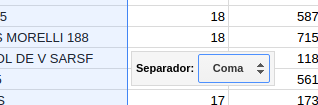

# Procesar CSV para Geolocalizar

Tomar el CSV con los datos de la carta marina y subirla a Google Drive.  
Una vez subido darle click derecho y elegir _abrir con_ y luego _hoja de calculo de Google_.  
Esto nos dará un entorno de planilla de cálculo online para mejorar los datos antes de su geolocalización.  


Nótese que una de las columnas incluye más de un dato. Esto es un _error_ (a veces intencional) que dificulta el análisis de datos. La columna _Escuela_ incluye:
 - El nombre de la escuela
 - La dirección de la escuela
 - En algunos casos el barrio


Google Sheets (la planilla de cálculo incluida en Google Drive) incluye una herramienta para estos casos. Excel y LibreOffice seguramente ofrecen posibilidades similares en este sentido.  

Como vamos a procesar la columna _Escuela_ no es mala idea hacer una copia de ella para referencias futuras en la medición de la efectividad de los procesos que vamos a usar.  

Hacemos un click en el encabezado de la columan _Escuela_ para seleccionarla. En el menú _datos_ elegimos la opción _dividir texto en columnas_. No ofrecera como _separador_ predeterminado a la coma



Nosotros cambiamos eso por un separador _personalizado_. Elegimos _" - "_ (espacio, guión, espacio) que es el que detectamos. Se requiere una segunda división sobre la segunda columna resultante ya que algunas dirección es incluyen el barrio (que no ayuda a la geolocalización) con el prefijo _"B°"_. Dividir entonces esta columna con el separador _"B°"_.  

Agregar en la planilla de cálculo las columnas _Ciudad_, _Provincia_ y _Pais_. A la columna Ciudad igualarla a la columna. Si bien no siembre es necesario la provincia y el país ya que algunos entornos de geolocalización permiten especificarlo nunca está de más.   

La columna Ciudad no es tan facil de llenar. En Córdoba los circuitos son localidades. Esto ayuda en general salvo en la Ciudad de Córdoba donde los circuitos electorales tienen nombres no formales vinculados algunas veces al barrio pero no son útiles a los fines de la geolocalización. Todas las escuelas de la seccional 1, sin importar el circuito, deben decir Córdoba en la columna _Ciudad_.  

En definitiva, la columna _Ciudad_ debe decir _Córdoba_ para la seccional _"Capital"_ y copiar la columna _Circuito Nombre_ en todos los otros casos. Esto se puede programar con la función: 

```
=if(B2="CAPITAL";"Córdoba";D2)
```

Para algunos sitios se requiere que todos los datos de una geolocalización este en una sola columna. Es util por esto agregar una columna más al final que se llame por ejemplo _Geo_ y que agrupe a las columnas
 - Direccion
 - Ciudad
 - Provincia
 - País
 - NO USAR BARRIO salvo que algún entorno mejore la geolocalización, en general esto no sucede

```
=CONCATENATE(F2;", ";H2;", ";I2;", ";J2)
```

Descargar esta planilla como CSV para llevar a alguna plataforma de geolozalización.  
Descargar trabajo hecho: [csv para geo](../recursos/escuelas-elecciones-2015-cordoba-FINAL-PARA-GEO.csv).  

### Geolocalizando en Fusion Tables

[Ver Mapa](https://fusiontables.google.com/embedviz?q=select+col11+from+1Se7MLXEFxIPOExxpSfEUNoMmY2p3Kh-AV3jWQS-e&viz=MAP&h=false&lat=-32.730273776177484&lng=-61.927968202880834&t=1&z=6&l=col11&y=3&tmplt=5&hml=GEOCODABLE)

```
<iframe width="500" height="300" 
    scrolling="no" 
    frameborder="no" 
    src="https://fusiontables.google.com/embedviz?q=select+col11+from+1Se7MLXEFxIPOExxpSfEUNoMmY2p3Kh-AV3jWQS-e&amp;viz=MAP&amp;h=false&amp;lat=-32.730273776177484&amp;lng=-61.927968202880834&amp;t=1&amp;z=6&amp;l=col11&amp;y=3&amp;tmplt=5&amp;hml=GEOCODABLE">
</iframe>
```

*Problemas*: 
 - No permite exportar coordenadas
 - Muy limitada capacidad de estilos según datos.
 - La herramienta no recibe actualizaciones hace mucho. Pareciera que Google no la va a continuar


### Geolocalziando con Google MyMaps

[Ver mapa](https://www.google.com/maps/d/view?mid=1zKL3m91IkHFJBXvDcE1kaVQJvfo&ll=-31.861778787428463%2C-63.61520641928098&z=7)

*Pros*: 
 - Permite iconos variados según algún campo.
 - La edición colaborativa es muy interesante.

*Problemas*: 
 - No permite exportar coordenadas.


### Geolocalizando en CartoDB

[Ver mapa](https://hudson.carto.com/builder/170fae5b-d302-4482-aa4d-13b67df9209b/embed)
Código para embeber
```
<iframe 
    width="100%" 
    height="520" 
    frameborder="0" 
    src="https://hudson.carto.com/builder/170fae5b-d302-4482-aa4d-13b67df9209b/embed" 
    allowfullscreen 
    webkitallowfullscreen 
    mozallowfullscreen 
    oallowfullscreen 
    msallowfullscreen>
</iframe>
```
*Pros*:
 - Amplias posibilidades para dar estilos a los puntos segun variables.
 - Si ya se cuentan con las coordenadas es muy potente.

*Problemas*: 
 - No permite exportar coordenadas.
 - Servicio de Geolocalización pago. Límite gratuito muy bajo


## Geolocalizar direcciones es complejo

Para desarrolladores se recomiendan usar los webservices de Google u OpenStreetMaps con scripts que gradualmente releven los datos necesarios.  

Una solución intermedia es usar un script (similar a los macros de Excel) en Google Sheets que permite hasta 1000 Geolocalizaciones por día. Es muy útil y funciona. Más info [aquí](https://www.datavizforall.org/transform/geocode/).  

