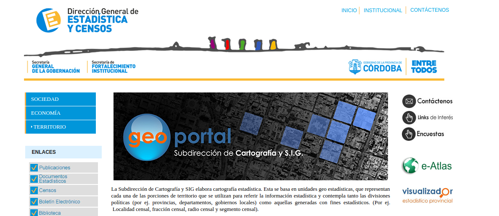
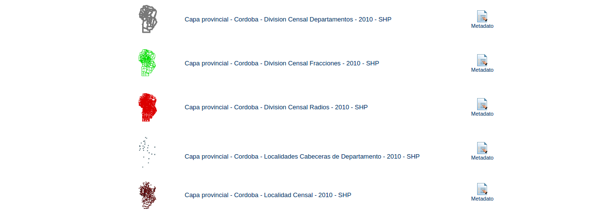

## Poligonos de Secciones y Circuitos

Para poner en mapas datos más agregados (por circuito o sección electoral) se requieren los _polígonos_ o puntos que los representan.  

### Secciones electorales

La secciones electorales (depratamentos) tienen una definición clara y están disponibles desde el [GeoPortal](http://estadistica.cba.gov.ar/Territorio/GeoPortal/tabid/564/language/es-AR/Default.aspx) de la Provincia de Córdoba.  

El GeoPortal incluye muchos datos útiles, en este caso tienen [una sección](http://estadistica.cba.gov.ar/Territorio/GeoPortal/CapasProvincia/CapasGeneralesProvincia/CapasdePol%C3%ADticayAdministraci%C3%B3nProvincia/tabid/847/language/es-AR/Default.aspx) que inluye (entre otros datos útiles) los _poligonos_ de los departamentos de la Provincia.  

El formato usado en general por el GeoPortal es el SHP ([_shapefile_](https://es.wikipedia.org/wiki/Shapefile)). Este formato es usado en ambientes técnicos y todavía no compatible con otras herramientas más simples de este curso.

Los departamentos de Córdoba en SHP pueden descargarse desde [aquí](http://estadistica.cba.gov.ar/LinkClick.aspx?fileticket=A4SgYgeHpIc%3d&tabid=696&language=es-AR).  

### Circuitos electorales

Los circuitos electorales de la provincia de Córdoba al parecer no están disponibles en formatos de polígonos en su totalidad.  

La Ciudad de Córdoba publica los polígonos de sus circuitos electorales (Córdoba es a la vez sección/departamento y una ciudad). Pueden verse y descargarse [aquí](https://gobiernoabierto.cordoba.gob.ar/data/datos-abiertos/categoria/legislacion/seccionales-y-circuitos-electorales/212).  

A diferencia de la provincia incluye un mapa online y múltiples formatos más simples de reutilizar por audiencias no especializadas.  

La realidad del resto de la provincia de Córdoba es compleja. Más del 80% del territorio provincia no pertenece a ningún municipio y los territorios que si pertenecen se encuentran en disputas actualmente.

[Ver más info](https://andresvazquez.com.ar/blog/los-municipios-de-cordoba-no-existen/)

El recurso más aproximado que aparece son los puntos de _localidades censales_ de 2010 que se encuentra en el mismo GeoPortal de la Provincia de Córdoba: [SHP Localidades Censales 2010](http://estadistica.cba.gov.ar/LinkClick.aspx?fileticket=eEKeiKWrGvE%3d&tabid=696&language=es-AR).  

