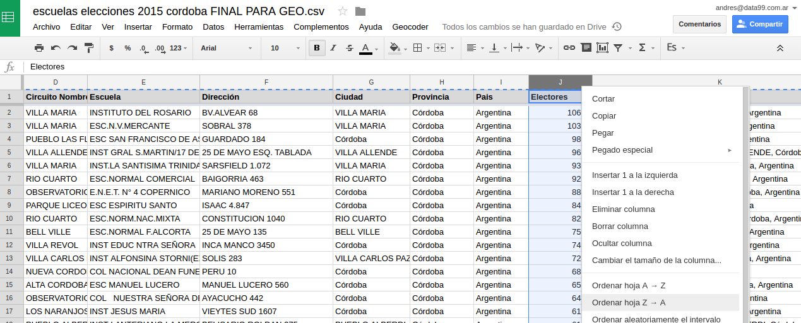
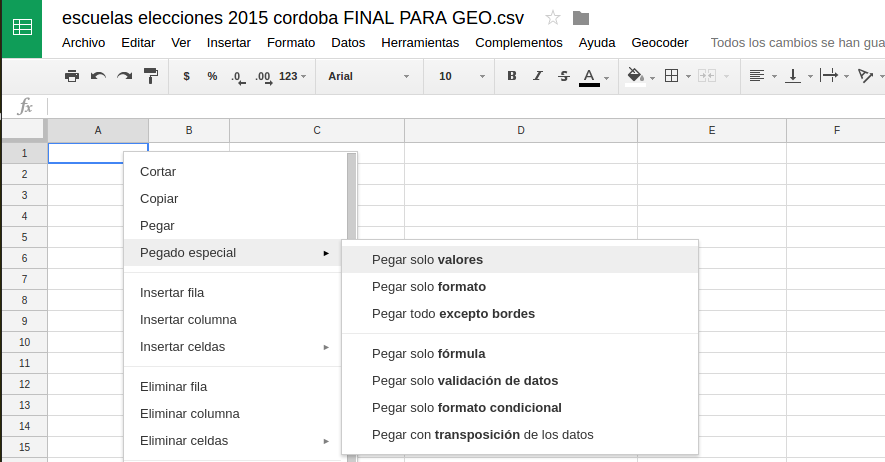
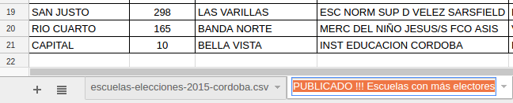
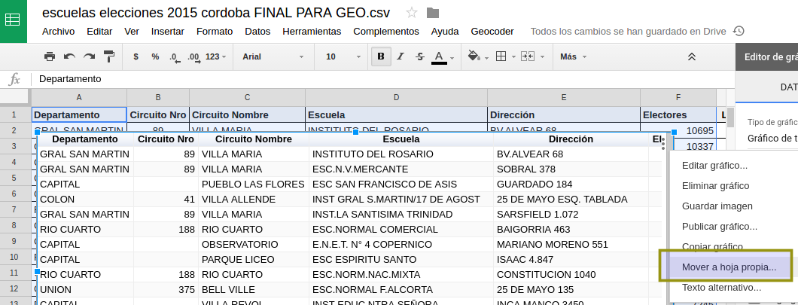
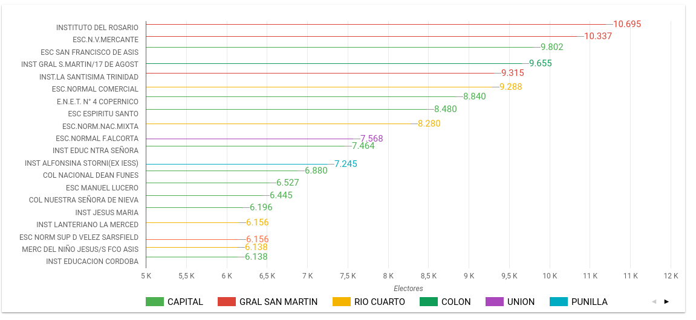
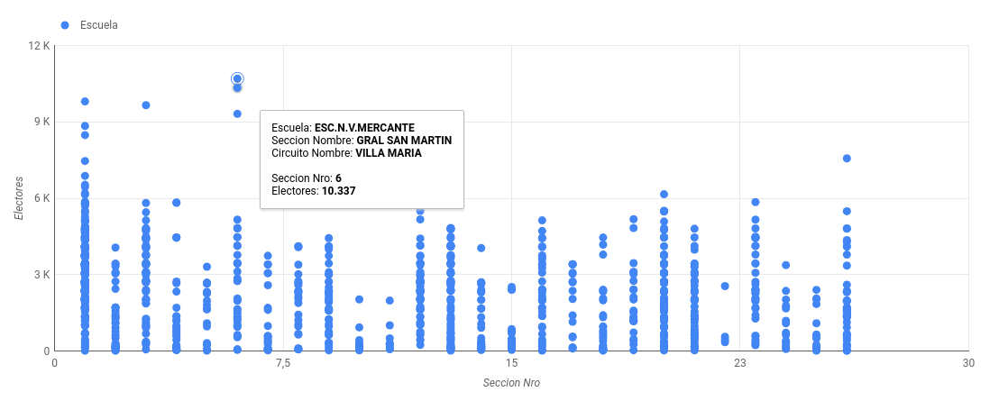
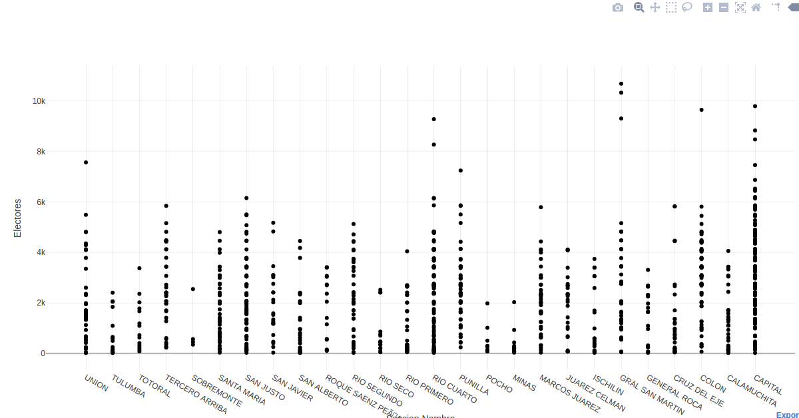

## Publicar tablas y gráficos 

### Desde Google Drive

Las planillas de cálculo locales (Excel o Open/LibreOffice) permiten siempre hacer gráficos. Por su naturaleza on-line, las planillas en Google Drive permiten además publicar el gráfico en una URL fija en internet.  

Esta característica nos permite tener gráficos listos para embeber en un medio online muy rápido. Esto funciona no solo para gráficos sino que incluye tablas de datos (útiles para mostrar junto a los datos).  

Como ejemplo vamos a tomar [la planilla que acompaña este curso de escuelas y electores por circuito geolocalizada](../recursos/escuelas-elecciones-2015-cordoba-FINAL-CON-GEO.csv).   

Vamos a _publicar_ (tabla y gráficos) una lista de las 20 escuelas con más electores.  
Para esto ordenamos la planilla por _Electores_ de mayor a menor.  

Copiamos los primeros 20 centros de votación y los pegamos (pegar **solo valores** ya que hay formulas que ya no son convenientes) en una nueva hoja del documento.  

Eliminar todas las columnas no necesarias para la publicación, volver a dat formato.
Esta hoja debe tener en el nombre algún indicador que note que hay información publicada online ya que eliminarla o modificarla hará que todo el contenido publicado se pierda o se modifique.  

Ahora se puede publicar inicialmente la tabla directamente (aunque el documento no sea de acceso público).  
Luego de marcar las celdas a publicar y presionar el boton _Insertar gráfico_ se elige el tipo _Gráfico de tabala_.  

Finalmente conviene aislar este gráfico a una hoja nueva por prolijidad.  

 ... y publicar  

 

El [link recibido](https://docs.google.com/spreadsheets/d/1CMHGvGB59HitcdHfdK_Uj6lU2G3_muC44L_pKoHNqOc/pubchart?oid=988967550&format=interactive) ya está listo para embeberse e insertarse en un sitio web.  

El recorrido de la seleccion de la tabla, la inserción del gráfico y la publicación puede usarse para cualquier tipo de gráfico. Esto es potente para complementar con múltiples gráficos una nota online.  

Algunos ejemplo más: 

Gráfico de barras

#### Sugerencia periodística sobre estos datos
 - Buscar el porque de la cantidad de electores muy superior en algunas escuelas.
 - Ver escuelas que más cambiaron de electores entres dos elecciones

### Con DataStudio

Con [DataStudio](https://datastudio.google.com) de Google tambien es posible conectar recursos de datos variados (archivos CSV, spreadsheets de Google y muchos otros).  

DataStudio permite combinar fuentes de datos y trabajar un poco más cómodamente que google Spreadsheets

Se puede ver online [aquí](https://datastudio.google.com/reporting/0B9saNutQ5ZYhZlpvYXQ2X1JIMVk/page/X7qG).  
#### Pros y Contras
Los gráficos de Google Spreadsheets son mejores para embeber, los de DataStudio son mejores para compartir como links externos.  

### Con Plot.ly

Plot.ly permite login con redes y es poco invasivo en cuanto a los permisos.  

Como diferencia de las anteriores permite exportar a HTML, esto hace posible descargar el gráfico completo como contenido estático de modo de usar esta visualización sin dependencia de la plataforma.

[Ver diagrama de dispersion](export-plot-ly/escuelas-por-departamento.html).  

Plot.ly apunta a usuarios mas de perfíl estadístico. Además los gráficos por defecto tienen zoom, posibilidad de descarga en PNG y otros detalles interesantes.  
Por ejemplo este [_Box Plot_o _diagrama de cajas](https://es.wikipedia.org/wiki/Diagrama_de_caja) de los electores por Departamento (_Sección_):  

[Ver gráfico box plot](export-plot-ly/box-plot-electores-por-departamento.html).  

Pequeños detalles a destacar de plot.ly. 
 - En los diagramas de cajas calcula automáticamente los _quartiles_ (a diferencia de drive que pide estos valores).  
 - En los [_diagramas de dispersion_](https://es.wikipedia.org/wiki/Diagrama_de_dispersi%C3%B3n) plot.ly no exige que ambos ejes sean numéricos. Podemos usar valores de texto y serán interpretados como _categorías_. 

### Otras formas a analizar

Usar App Script para hacer un sitio con D3 que consuma los datos de la planilla: [aquí](http://www.benlcollins.com/spreadsheets/d3-google-sheets/)
