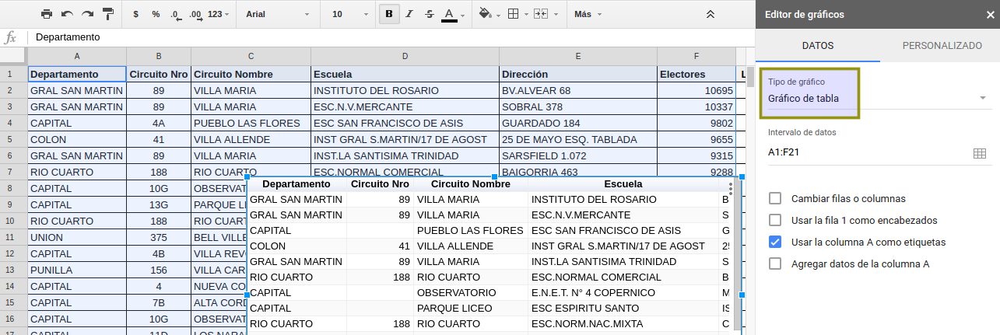

## Publicar tablas y gráficos desde Google Drive

Las planillas de cálculo locales (Excel o Open/LibreOffice) permiten siempre hacer gráficos. Por su naturaleza on-line, las planillas en Google Drive permiten además publicar el gráfico en una URL fija en internet.  

Esta característica nos permite tener gráficos listos para embeber en un medio online muy rápido. Esto funciona no solo para gráficos sino que incluye tablas de datos (útiles para mostrar junto a los datos).  

Como ejemplo vamos a tomar [la planilla que acompaña este curso de escuelas y electores por circuito geolocalizada(../recursos/escuelas-elecciones-2015-cordoba-FINAL-CON-GEO.csv).   

Vamos a _publicar_ (tabla y gráficos) una lista de las 20 escuelas con más electores.  
Para esto ordenamos la planilla por _Electores_ de mayor a menor.  

Copiamos los primeros 20 centros de votación y los pegamos (pegar **solo valores** ya que hay formulas que ya no son convenientes) en una nueva hoja del documento.  

Eliminar todas las columnas no necesarias para la publicación, volver a dat formato.
Esta hoja debe tener en el nombre algún indicador que note que hay información publicada online ya que eliminarla o modificarla hará que todo el contenido publicado se pierda o se modifique.  

Ahora se puede publicar inicialmente la tabla directamente (aunque el documento no sea de acceso público).  
Luego de marcar las celdas a publicar y presionar el boton _Insertar gráfico_ se elige el tipo _Gráfico de tabala_.  

Finalmente conviene aislar este gráfico a una hoja nueva por prolijidad.  

 ... y publicar  

 

#### Sugerencia periodística 
 - Buscar el porque de la cantidad de electores muy superior en algunas escuelas.
 - Ver escuelas que más cambiaron de electores entres dos elecciones