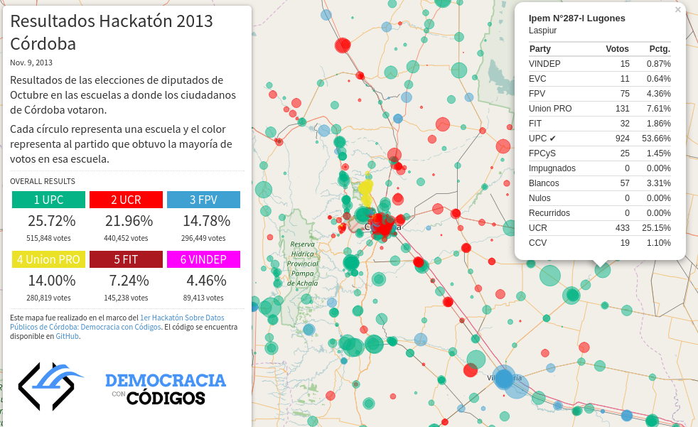
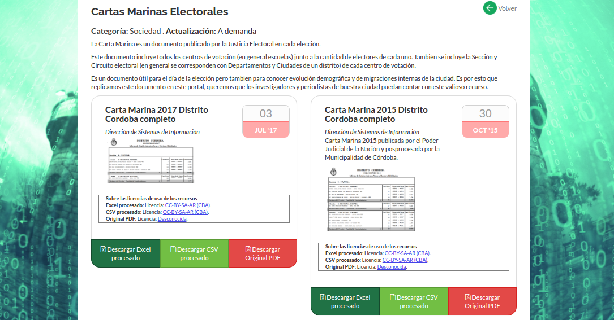
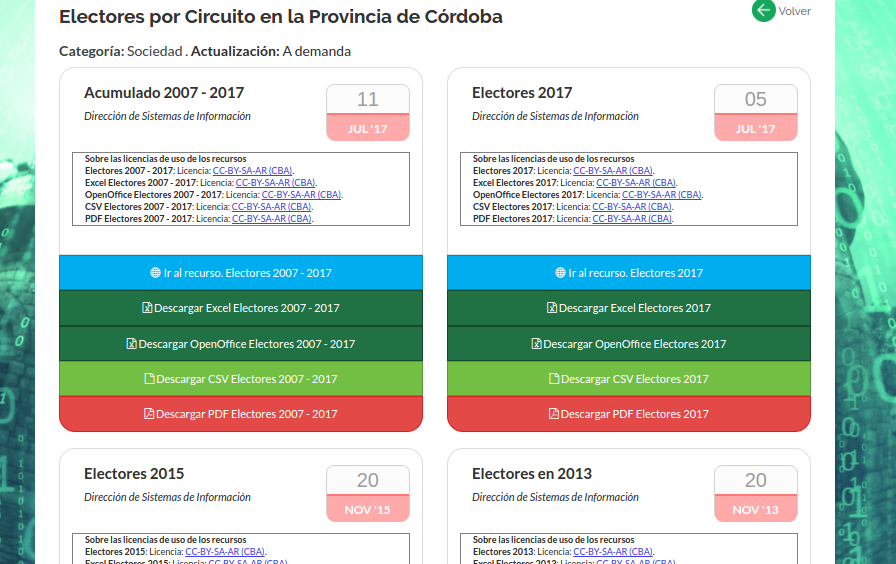
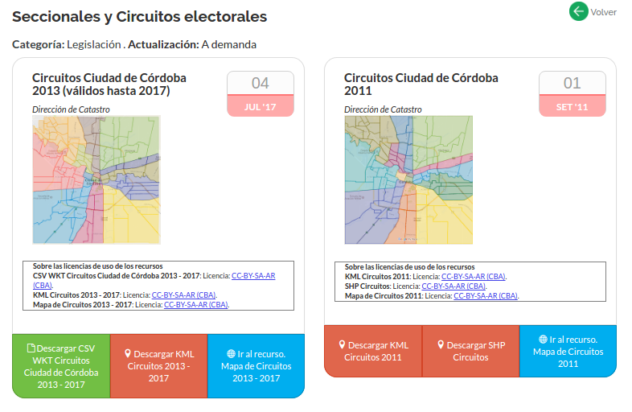
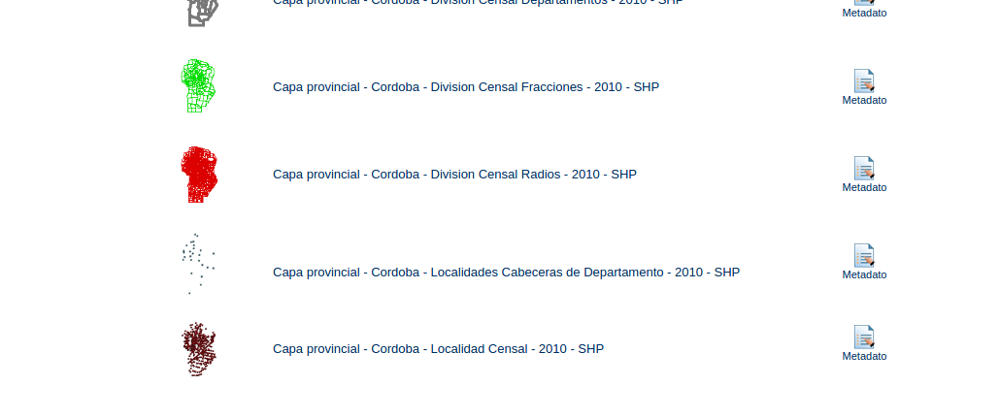

# Recursos y ejemplos

Un caso muy interesante con un producto similar al buscado aquí se hizo para las elecciones 2013 en Córdoba. Se realizó durante un hackathon orgnizado por [OpenDataCordoba](http://www.opendatacordoba.org/) y se llamó Democracia con códigos.    
Se puede ver el código abierto [aquí](http://democraciaconcodigos.github.io/) y el mapa [aquí](http://democraciaconcodigos.github.io/election-2013/).  

  

## Cartas marinas públicas

En el portal de Gobierno Abierto ya se encuentran disponibles las Cartas Marinas 2015 y 2017 pasadas a formatos reutilizables [aquí](https://gobiernoabierto.cordoba.gob.ar/data/datos-abiertos/categoria/sociedad/cartas-marinas-electorales/213).  

## Datos de electores por circuito electoral 2007 - 2017

Basados en trabajos previos de OpenDataCordoba y otros recursos trabajados por desde el portal de Gobierno Abierto ya se encuentran disponibles los resúmenes de electores por Circuito Electoral de Córdoba en formatos reutilizables [aquí](https://gobiernoabierto.cordoba.gob.ar/data/datos-abiertos/categoria/sociedad/electores-por-circuito-en-la-provincia-de-cordoba/216)

## Mapas de base para reutilizar

Polígonos de los circuitos electorales de Córdoba [aquí](https://gobiernoabierto.cordoba.gob.ar/data/datos-abiertos/categoria/legislacion/seccionales-y-circuitos-electorales/212).  

Polígos de las secciones electorales de Córdoba (Departamentos) [aquí](https://gobiernoabierto.cordoba.gob.ar/data/datos-abiertos/categoria/datos-geograficos-y-mapas/departamentos-de-la-provincia-de-cordoba/214).  

Desde el GeoPortal de la Provincia de Córdoba las localidades censales 2010. Lo mas aproximado para tener circuitos electorales de toda la Provincia de Córdoba Geolocalizados [aquí](http://estadistica.cba.gov.ar/Territorio/GeoPortal/CapasProvincia/CapasGeneralesProvincia/CapasdePol%C3%ADticayAdministraci%C3%B3nProvincia/tabid/847/language/es-AR/Default.aspx). Copia local [aquí](../recursos/Capa-provincial-Cordoba-Localidades-Censales-2010-SHP.zip). Versión pasada a CSV WKT localmente [aquí](localidades-cordoba-2010-pasadas-de-SHP-a-CSV-con-coordenadas.csv).  

