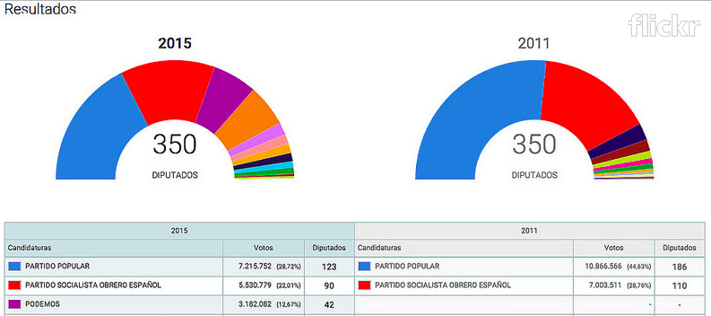
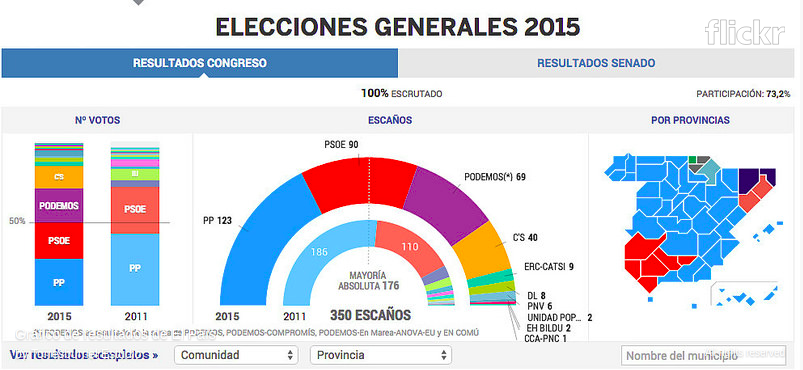
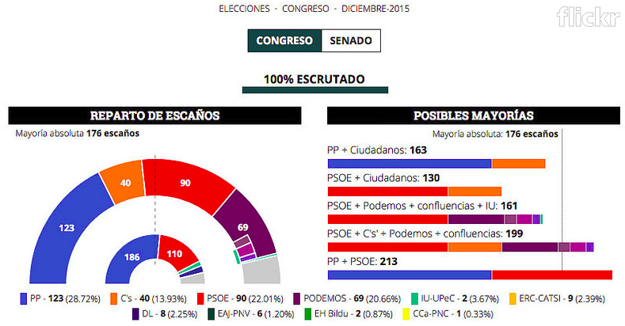
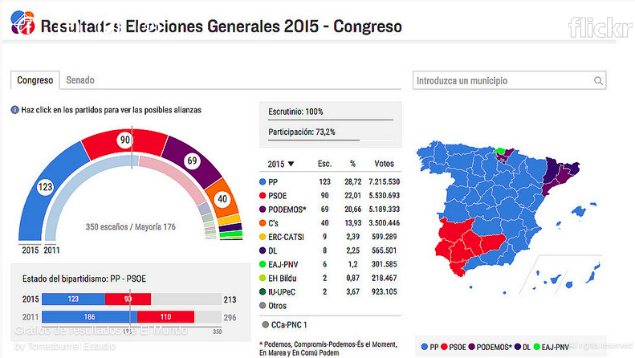

## Visualizaciones legislativas

Ver ejemplos:
[Interesante análisis](http://www.torresburriel.com/weblog/2016/02/01/visualizacion-de-datos-electorales-en-sitios-de-medios-de-comunicacion/) de visualizaciones varias de medios europeos.  

[Hemicilo LNData](http://especiales.lanacion.com.ar/multimedia/proyectos/15/elecciones/hemiciclo_elecciones_2015/index.html).  

