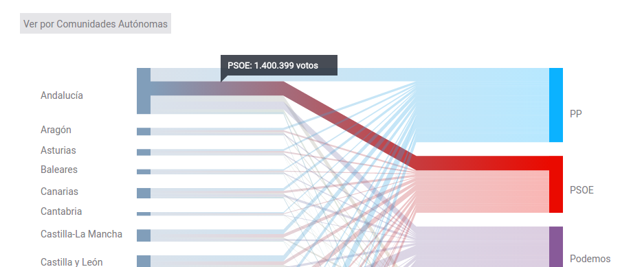

## Visualizaciones legislativas

Ver ejemplos:
[Interesante análisis](http://www.torresburriel.com/weblog/2016/02/01/visualizacion-de-datos-electorales-en-sitios-de-medios-de-comunicacion/) de visualizaciones varias de medios europeos.  

[Hemicilo LNData](http://especiales.lanacion.com.ar/multimedia/proyectos/15/elecciones/hemiciclo_elecciones_2015/index.html).  

Visualización de ciudades y partidos de [el Pais en 2015](https://elpais.com/elpais/2015/12/18/media/1450462864_878758.html).  

Con código
D3 Hemicilio simple: http://bl.ocks.org/tomgp/9212008  
D3 Hemicilio con íconos: http://bl.ocks.org/michalskop/2e2a2aed537d1a5f03c3  
Posible referencia: http://olcreativa.lanacion.com.ar/dev/test/votaciones/  